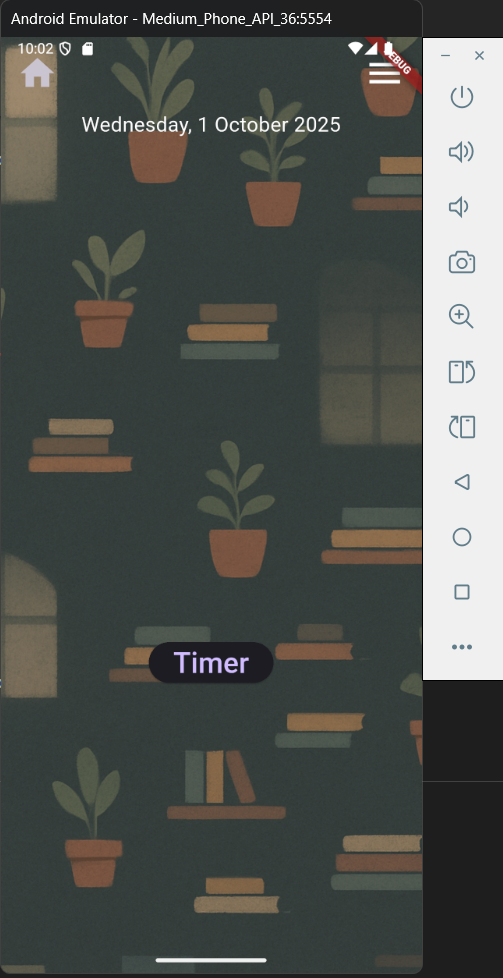

# Lofi-Life-Tracker-App (v1.0.0) - Study Tool Enhanced with AI

 <!-- Add a screenshot later -->

## Overview
The Lofi-Life-Tracker-App is a Flutter-based mobile app designed to help university students, especially physics majors, manage tasks and lab schedules with a soothing lofi-inspired interface. Built over the summer of 2025 during my final year at [Your University], this project showcases my ability to leverage large language models (LLMs) like Grok for rapid development, debugging, and feature enhancement—producing a tool far beyond what I could achieve solo.

Key AI contributions:
- **Prototyping**: Grok generated initial Dart code for state management, saving days of setup.
- **Debugging**: Resolved async data issues in real-time with AI guidance.
- **UI Polish**: Suggested Material Design 3 tweaks for a smoother user experience.

## Features
- Task tracking with deadlines and reminders.
- Lab schedule integration (e.g., physics experiment timers).
- Customizable lofi background themes.
- Offline functionality using local storage.

## Tech Stack
- **Language/Framework**: Dart with Flutter (v3.x)
- **State Management**: Provider (or Riverpod, if you used it)
- **UI**: Material Design 3, custom animations
- **Storage**: sqflite (or similar, if applicable)
- Developed in VS Code with AI assistance

## Getting Started
1. Clone the repo: `git clone https://github.com/NobleNatty/Lofi-Life-Tracker-App.git`
2. Install Flutter: Follow [flutter.dev/docs/get-started/install](https://flutter.dev/docs/get-started/install).
3. Run `flutter pub get` in the project root.
4. Launch: `flutter run` (connect a device or emulator).
5. Explore physics mode: Toggle lab tracking in the settings.

## Screenshots
| Home Screen | Task List | Lab Timer |
|-------------|-----------|-----------|
|  |  |  |

## Future Plans
- Add ML-driven task prioritization.
- Expand to web for cross-platform use.
- Integrate real-time physics data feeds.

## License
MIT License—feel free to fork and adapt! See [LICENSE](LICENSE) for details.

---

Built with ❤️ and AI assistance from Grok by xAI. Questions? Open an issue!
